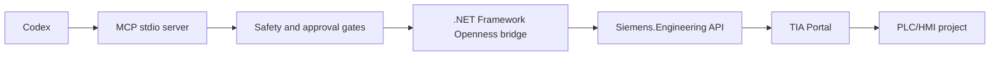

# Architecture

## Target Shape

## Components

- `TiaPortalAgenticToolkit.McpServer`: MCP protocol, tool definitions, JSON-RPC stdio.
- `TiaPortalAgenticToolkit.Openness`: Windows and TIA Portal Openness discovery, future Siemens.Engineering bridge/adapter.
- `skills-catalog`: Codex procedural knowledge for PLC/HMI/safety workflows.

Note: real Siemens.Engineering calls should run on the TIA Portal workstation/VM. Siemens documents Openness programming with .NET Framework 4.8 assemblies, so the implementation should isolate that dependency behind a Windows-only bridge.

## Tool Roadmap

Read-only first:

- `tia_environment_status`
- `tia_list_portal_processes`
- `tia_attach_running_portal`
- `tia_project_overview`
- `tia_export_plc_blocks`
- `tia_export_udts`
- `tia_export_tag_tables`
- `tia_compile_plc_software`

Write-capable later:

- `tia_import_block_xml`
- `tia_import_udt_xml`
- `tia_create_scl_block`
- `tia_update_hmi_script`
- `tia_save_project_copy`

Write-capable tools must require explicit user approval and should create backups or exports before modification.
